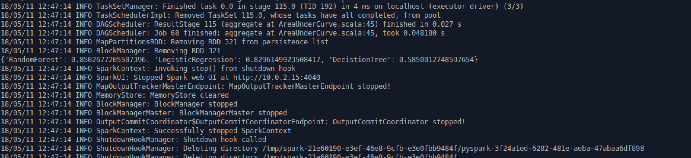
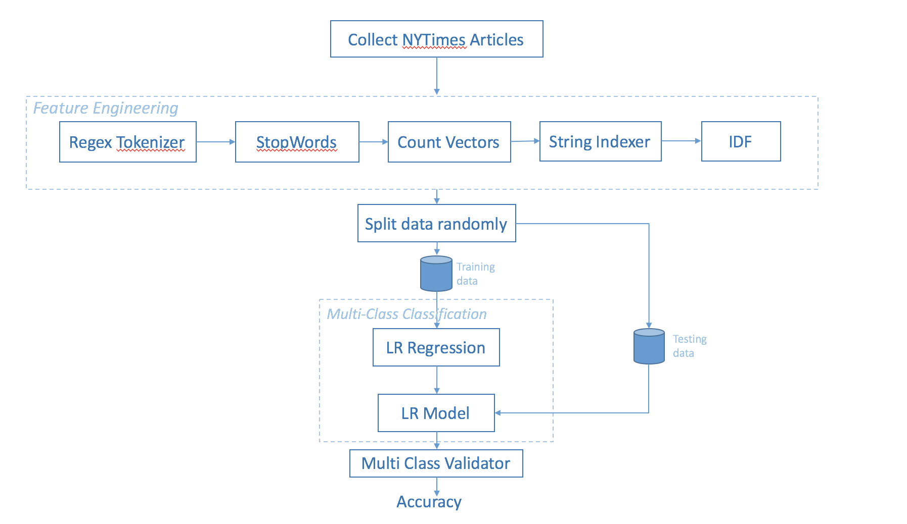
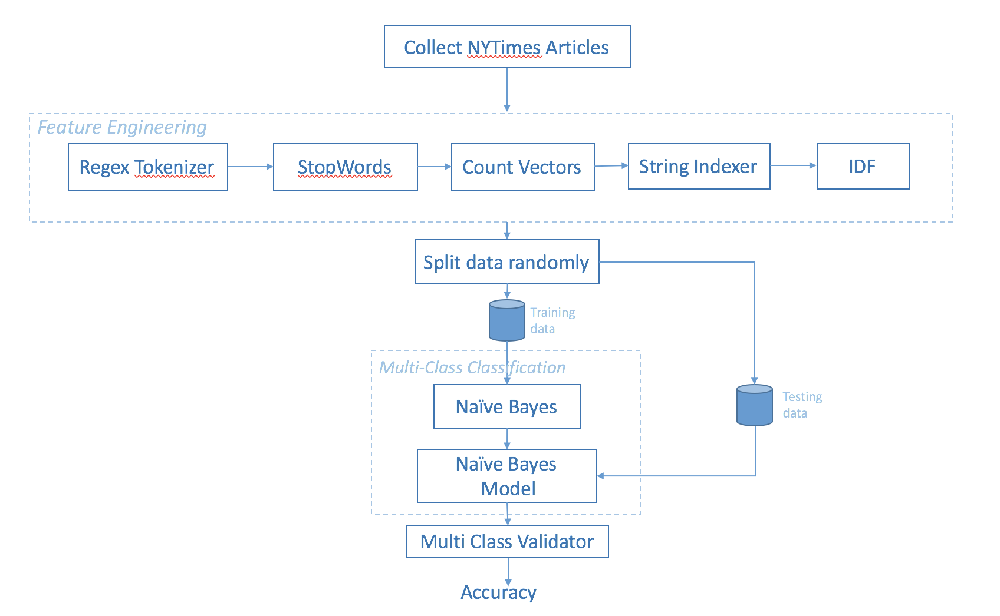
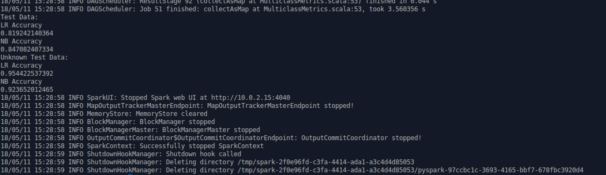

# REPORT

Pretty Mary Philip 5024 7311   
Tejaswini Reddy Boda 5024 3913

## PART 1
### Titanic Ouput:
RandomForest: 0.8502677205507396  
LogisticRegression: 0.8296149923508417  
DecistionTree: 0.5850012748597654

ScreenShot:

## PART 2
### Environment Details:
Following are the environment chosen for this Lab:
1. Apache Spark run on Virtual Machine (provided for Lab2 - Hadoop)
2. Scripts were written in Python

### Steps to run the program:
Note: Our file directory for the python script is /spark/lab3/src/script.py and for the data is /spark/lab3/data
1. From the terminal, traverse to the folder spark/
2. Run the script by spark-submit /lab3/src/script.py
3. You can see the accuracy returned by the Logistic Regression and Naive Bayes on the console

### Documentation

1. Collect data   
Data was collected using NYTimesArticles-API (as used in lab2) for the following categories:
  - Business : Stock, Economy, Finance
  - Sports : NBA, BFL, Golf
  - Politics : President, Trump, Election
  - Entertainment : Met Gala, TMZ, SNL
2. Dataframe   
Read all articles from each of the category and appended it into a spark-dataframe along with a column specifying the category name.
3. Feature Engineering   
  - Tokenizer : Tokenize each article into words using space delimiter. Used RegexTokenizer API from pyspark
  - Stop Words : Removed commonly used words unrelated to the categories. Used StopWordsRemover API from pyspark
  - Count Vectors : Used CountVectorizer to count the frequency of each word occurring in an article (Similar to term frequency)
  -  String Indexer : Converted every category to an integer label using StringIndexer from pyspark
  - IDF : Used IDF API to calculate
 the frequency of each word in a category
4. Splitting of Dataframe   
Used pyspark's random-split API to split the data to training data(80%) and test data(20%)
5. Multi Class Classification   
  - Logistic Regression : Used pyspark's LogisticRegression API to create a LR model using the training data. The labels of the test data were predicted using the trained LR Model.
###### Logistic Regression Classification pipeline:

  - Naive Bayes Classification : Used pyspark's NaiveBayes API to create a Naive Bayes model using the training data. The labels of the test data were predicted using the trained Naive Bayes model.     
###### Naive Bayes Classification pipeline:

6. Accuracy   
The accuracy of the classification model was determined using the MulticlassClassificationEvaluator API from pyspark by comparing the predicted labels from the classification model and the test data's labels
7. Testing   
An unknown set of labelled data was collected and classified using the steps and the accuracy was determined

### Output:
1. Test Data Accuracy  
    - Logistic Regression : 81.92%
    - Naive Bayes : 84.7%
2. Unknown data Accuracy
    - Logistic Regression : 95.44%
    - Naive Bayes : 92.36%

ScreenShot:

